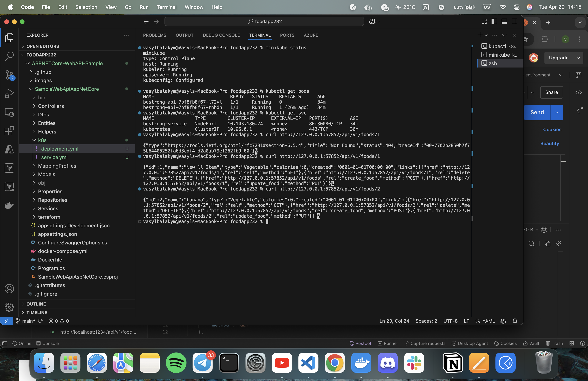

report for task 2(minikube and kuber)

# Architecture Report for Microservice Solution Deployment in Azure

[![Microservice Architecture Diagram](https://mermaid.live/edit#pako:eNqlVEtrGzEQ_itCpwRsx6_1YymB2CYQjNsQlxS69kGO1fWSXclotbSOMaRJKT30WHzqpf8g0AbalKR_QfuPOtqHX03rQ3VYaWa--WY0M9opPuNDik1sCzIeoeeNHkOwmq5DmbRe0MFehw8clyJ1p36G8_CTug-v1Pc-ymb30aHgTLY4F9bBRSBoLCOt6Mc08dcPBjF7D8e4U0fIgLjoKZWvuTjv4Rin14IyCnBwfNRJuOGIOoQRm3qQWX_psTytxml3URa1gwEVjErqr4bQSxNHEY6YLajvW8mOmhBecNelor_usS6l8CjJQI6Az9K7Jn4yEHv7LX52ToWu2kNUsVv1Q92r2_Cy_3eiQ86Hmkjv_0X0TI6o0EzqPfh8COfb2aCl_7pvcseIvUUksXbUF_UrnMNMfASiOVLf1I0-7G7QJHdaOK5b00QfMVM2fKzHGhShm9z3uN9qWDvxfMQyajVWM1igu5ILGJ0UnIi728Yoqt87qM5N-Da8Ci_Da3UH-7XW_DFSzRMrTYVJ4jCo8wm1HV-KyUZR2nRySgJXJngQUSRvwDqcOZCow2xLfY4aNoeWPehmQdO-9rcWC1KKJ7TdXSrT4Cib2zRFr0Zrl5FjI_DjDPwinCE2pQhoBntUeESLeKohPQyd9GgPm3AckvhNz8BnTNhLzr3UTfDAHmHzFXF9kILxkEjacgjU21toBUSjoskDJrFZKBWNiAWbU_wGm9liMVeulMqles2oV2rVMlgn2KzVc5Vq3SgVC2WjmjeM8iyDL6K4-VzVqJTy-VqhXikUquA1-w0Kc6WU

## Rationale for Azure Architecture Choice

For deploying the solution in Azure, we propose a microservice architecture using Kubernetes and Docker for the following reasons:

### 1. Scalability
Containerization with Kubernetes allows automatic scaling of individual microservices based on demand. When traffic to a particular service increases, Kubernetes can automatically increase the number of its instances (pods), and when the load decreases, reduce them, optimizing resource utilization.

### 2. Fault Tolerance
Kubernetes provides self-healing services in case of failure, improving overall system reliability. If a container or pod fails, Kubernetes automatically restarts it. When an entire cluster node fails, pods are automatically restarted on other available nodes.

### 3. Development Flexibility
Docker containers provide an identical environment from development to production, reducing "works on my machine" problems. Each microservice is packaged with its dependencies in an independent container, ensuring isolation and stable execution.

### 4. Efficient Resource Utilization
Containers allow better utilization of computing resources compared to traditional virtual machines. They have lower overhead, start faster, and allow for denser application placement on physical servers.

### 5. Unified Management
Azure Kubernetes Service (AKS) provides a single platform for managing all microservices. This simplifies deployment, monitoring, and maintenance of the system, providing centralized management of the entire infrastructure.

## Key Architecture Components

### Azure Virtual Network
* Isolated network environment for all system components
* Segmentation into subnets for additional security
* Control of inbound and outbound traffic through Network Security Groups (NSGs)

### Azure Front Door & API Management
* Global load balancer and DDoS attack protection
* Routing requests to microservices according to rules
* API management, documentation, and access control through a single entry point

### Azure Kubernetes Service (AKS)
* Managed Kubernetes cluster for running containers without the need to manage master nodes
* Ingress Controller for routing HTTP traffic between services based on URL paths
* Horizontal Pod Autoscaling (HPA) based on CPU/memory load

### Docker Containers
* **Auth API**: container for user authentication, performs token validation and access management
* **Food API**: container for food data operations, processes requests for creating, reading, updating, and deleting
* **Other APIs**: additional microservices that can be independently deployed and scaled as needed

### Data Storage
* **Azure Cosmos DB**: distributed NoSQL database for storing microservice data with high availability
* **Azure Storage**: storage for binary and static data such as images, documents, and other files

### Infrastructure Components
* **Azure Container Registry (ACR)**: private registry for storing Docker images with AKS integration
* **Azure Key Vault**: secure storage of secrets, certificates, and keys for containers
* **Monitoring**: comprehensive system performance monitoring through Azure Monitor & Log Analytics

## How Docker & Kubernetes Work in This Architecture

### Docker in Microservice Architecture

1. **Microservice Isolation**
   * Each microservice is packaged in its own Docker container
   * The container includes everything needed for the service to operate: code, dependencies, configuration
   * Isolation guarantees that changes in one service do not affect others

2. **Image Building Process**
   * A Dockerfile with build instructions is created for each microservice
   * Multi-stage builds are used to optimize the final image size
   * Images are automatically built through the CI/CD pipeline and published to Azure Container Registry

3. **Containerization Benefits**
   * Fast service startup — milliseconds instead of minutes as in VMs
   * Ability to precisely control versions of each service
   * Stable execution environment regardless of the underlying host

### Kubernetes for Orchestration

1. **Cluster Organization**
   * AKS cluster is placed in an Azure virtual network
   * Cluster nodes are distributed across availability zones for high availability
   * Kubernetes system pods run separately from user applications

2. **Microservice Deployment**
   * Each microservice is defined as a Deployment in Kubernetes
   * Configuration is done through ConfigMaps and Secrets
   * Services and Ingress are used for network communication

3. **Automatic Scaling**
   * Horizontal Pod Autoscaler (HPA) monitors service load
   * Additional pod instances are created when load increases
   * Excess pods are removed when load decreases to save resources

4. **Self-healing and Updates**
   * When a container fails, Kubernetes automatically creates a new one
   * Microservice updates occur using the Rolling Update strategy without downtime
   * Possibility to rollback to a previous version if problems arise

5. **Network Communication**
   * Ingress Controller routes external requests to appropriate services
   * Service Discovery enables communication between microservices by name
   * Network policies control which services can communicate with each other

## System Component Interaction

1. **User Request Path**
   * Request comes through Azure Front Door, which provides global access and security
   * API Management performs authentication, rate limiting, and request logging
   * Ingress Controller in AKS directs the request to the appropriate microservice
   * The microservice processes the request and accesses the database as needed

2. **Inter-microservice Communication**
   * Microservices communicate with each other through Kubernetes internal network
   * Synchronous communication occurs via REST API or gRPC
   * Asynchronous communication is done through message queues

3. **Data Access**
   * Each microservice has limited access only to its own data
   * Connection to Azure Cosmos DB is made through Azure managed identities
   * Secrets and access keys are stored in Azure Key Vault and connected via CSI Driver

## Benefits of This Architecture

1. **Portability** - identical environment from development to production thanks to containers
2. **High Availability** - automatic service self-healing during failures
3. **Flexible Scaling** - dynamic resource changes based on demand, pay only for resources used
4. **Service Isolation** - protection from cascading failures, ability for independent development by different teams
5. **Simplified Deployment** - unified approach for all microservices through Kubernetes manifests and Helm charts